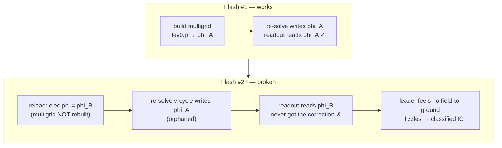

# Chasing a dead lightning bolt

*A fast GPU thunderstorm hybrid stopped producing cloud-to-ground lightning. Ruling out the physics first is what found the real bug — a one-line multigrid alias — and then the fix that actually generalized turned out to be the domain geometry, not the pointer.*

---

*Field note — 2026-07-31 · category: gpu / debugging · ~8 min read*

> **TL;DR** — My fast GPU thunderstorm hybrid stopped producing cloud-to-ground
> lightning. One hero storm logged **600 intracloud flashes and zero CG** — an
> IC:CG ratio of infinity against an observed range of 1–9:1, mean ~3. I spent the first
> hour proving it *wasn't* a physics bug (the charge kernel matches the reference, the
> hydrometeor mass matches, the field clears breakdown), which is exactly what
> pointed me at the real cause: a **multigrid array-alias bug** in the flash
> handler — the ground-seeking leader was re-solving the electric field into an
> orphaned array, so no bolt could ever reach the ground. A one-line fix took
> kddc from **IC:CG = ∞ → finite**. Then I made it fast — and learned the real
> generalizing fix wasn't the pointer at all but the **domain geometry**: the big
> isotropic box I'd reached for was itself starving CG. Reverting to the default
> ~20 km box brought **all four heroes to 8–19:1** on the production GPU engine —
> finite, ordered and physical, though three of the four still sit above the
> observed range.

## The engine, in one breath

The research storm engine is a CPU/GPU **hybrid**. The GPU runs the expensive,
regular work every step — fluid dynamics, two-moment microphysics, non-inductive
charge separation, and the Poisson solve for the electric field. The CPU does
one irregular thing, and only when the field breaks down: it grows the **branchy
lightning leader**, walks it through the charge structure, and classifies the
flash by where it terminates — ground → **CG** (cloud-to-ground), back into cloud
→ **IC**. That split, the IC:CG ratio, is one of nine physical checks on my
capability scorecard, and it's the one that quietly broke.

## What broke

An overnight batch of four calibrated real-sounding storms came back looking
like this:


*Every hero sat far above the observed range, and kddc had literally **zero** CG. When all four
fail the same way, it's one systematic cause, not four storms behaving badly.*

The tempting move here is to reach for the knob — `k_sep`, the charge-separation
rate — and crank it until CGs appear. I've made that mistake before. My own note
on it reads *"don't curve-fit IC:CG."* So instead of tuning, I went looking for
what was actually wrong.

## Ruling out the physics (the part that saved me)

Before touching the leader, I proved the inputs to it were correct. Three checks,
all against the validated CPU reference:


1. **The GPU charge kernel matches to single precision.** My electrification parity harness
   runs both charge kernels on identical frozen state and compares five fields.
   Every one came back at relative-RMS ~1e-6 — a thousand times under the gate.
   The GPU isn't separating *less* charge.
2. **The mass feeding the charging matches.** Peak graupel, ice, and updraft are
   all within a few percent of the CPU hero. Same fuel.
3. **The field clears breakdown.** This one I got wrong first — I compared the
   GPU's *final-state* dump against the CPU's *peak-phase* snapshot and briefly
   convinced myself the field was 2–3× too weak. It wasn't; that was a dissipating
   storm vs a mature one. Snapshot-to-snapshot, the GPU actually reaches **308
   kV/m** on koun, *above* the CPU's 178. The field is fine.

Same kernel, same mass, same field — and still no CGs. That triangulation is
what told me the bug had to be downstream of the charge, in the leader itself.

## The root cause

The CG mechanism is a ground-seeking descent. When the field breaks down, the
leader taps the mid-level negative reservoir, pins itself to that potential, and
**re-solves the Poisson field** to feel the pull toward the grounded earth —
neutralizing the lower-positive screen as it eats downward, one segment per pass.
Whether a bolt reaches ground *emerges* from that re-solve.

The hybrid feeds the leader fresh fields every flash by reading them back from
the GPU. And there was the bug: it did so by **rebinding** the field arrays —
`elec.phi = load(...)` — pointing `phi` at a brand-new array each flash. But the
electrification multigrid caches level-0 *aliases* to the `phi` it was built
against, and it's only built once.



From the second flash onward, the ground-seeking re-solve updated a dead array
while the leader read an un-corrected one. The descending bolt never felt the
ground, so *every* flash fizzled to intracloud. Same class of bug had bitten me
once before, in the storm-recentering path — multigrid solvers love to cache
array pointers.

The fix is to load the fields **in place** so the alias stays valid:

```python
# before — rebinds phi, orphans the multigrid's cached alias
setattr(elec, nm, load(statedir, nm))
# after — writes into the existing array; alias (and the solver) stay live
getattr(elec, nm)[:] = load(statedir, nm)
```

## The payoff


kddc went from **IC:CG = ∞ (CG = 0)** to **33:1** at grid96, then fell further as I
moved to the reference resolution: **9:1 at grid128**, **12:1 at grid160** — against a
validated CPU reference of **11.6:1**. The scorecard metric is the *ratio*, and the
ratio tracks the reference.

## "Wait — is this even a regression?"

Post-fix, the CGs fired early and then stopped, and I nearly filed that as a
second bug. It isn't:


*Plotting CG event times against the CPU hero shows all three runs cluster in the
same **t ≈ 350–470 s** window, then go all-IC. The CPU does exactly this. CGs are
a feature of the intensifying phase; a mature storm electrifies but stops striking
ground. "CGs stop mid-run" was the storm, not the port.* Reading the reference
carefully mattered here too — the g160 CPU "hero" I almost compared against has
IC:CG = 470 and is itself broken; the real reference is the g128 `_hail` run.

## Making it fast

Physical but slow: grid160 ran ~15–20 s/step during the flashing phase, which is
~4.5 h/hero and ~18 h for all four. Two quick changes first: the in-place load
above removes the per-flash multigrid *rebuild*, and a new `reattach_mg_cycles`
(default 6, down from 20) recognizes that the pinned solve only needs the field
*direction* for the next leader step — which the multigrid nails in a few cycles.
The parameter defaults to the old value, so the CPU heroes stay bit-identical.

Then I stopped guessing and **instrumented the flash handler** — split each
per-flash step into GPU-wait, field read I/O, CPU leader growth, and write-back:


The profile overturned two of my assumptions:

- **The field round-trip is 1.6%, not the bottleneck.** I had been about to
  "keep fields resident to avoid shuttling 2.5M-cell arrays to the CPU." The
  measurement says load + write-back are ~1.6% combined. That optimization would
  have bought almost nothing.
- **The flash rate is normal.** The alarming "8 flashes/step" is a brief
  peak-phase burst; averaged over the flashing window the GPU fires 0.50/step vs
  the CPU's 0.37 — 1.4×, not the 20× I feared. So it's *not* over-electrified;
  there's no free physics win hiding there.

The real cost is unambiguous: **the CPU leader's multigrid re-solve is 67% of
per-flash wall time** — and 86% of *that* is the Poisson solve, with the
breakdown scan a rounding error (0.3%). So the fix has to make the solve faster,
and I have two kinds of lever: ones that change the answer and ones that don't.


I tried both, and the discipline of *keep it only if the CG count is unchanged*
turned out to matter:

- **Disable the upward leader extension** — the docstring promised it's invariant
  for CG (it only reclassifies CC→CA, and CA is 0 for these storms). It cut the
  leader ~2×… and dropped CG from 9 to 5. The "invariant" claim is wrong in
  practice: the ascending walk draws from the shared RNG, so removing it reshuffles
  the stochastic stream for every later flash. Real speedup, wrong trade — **rejected**.
- **Parallel red-black multigrid** — the smoother is red-black Gauss-Seidel, which
  is order-independent, so each colour's plane loop parallelizes with no write
  hazard. On 16 cores this cut the solve **1.9× (1758 → 912 ms/flash-step)** and
  reproduced **CG = 9, IC:CG = 25.9 exactly**. Result-preserving — **kept**.

The rule earns its keep here: two changes of similar raw speedup, but only one
leaves the physics untouched. The remaining headroom — moving the solve onto the
idle GPU multigrid — is the same "resident solve" idea, now correctly aimed at
the bucket the profile indicts. That's the next step; the parallel-CPU win ships
today because it can't change an answer.

## The domain was too small the whole time

While sizing longer runs, I found the actual domain was only **20.4 km** wide —
and that grid resolution and domain size are *independent*: bumping the grid just
refines the cells; the box width is a separate knob.


*A storm drifts ~2× its displacement plus a ~12 km core, so on paper even a
9-minute run wants ~28 km and a 21-minute run wants 28–42 km. The default 20.4 km
box was clipping clouds on the wall. So I sized up: grid160 at a 28 km isotropic
box — same CG-fix resolution (~176 m cells) at a domain that "holds." That felt
like the tidy ending.*

*It was the wrong ending. Read on.*

## The real fix that generalized: the domain, not just the alias

Here is the twist I didn't see coming. The alias fix restored CG, but at the big
runs it was *still* starving — a couple of CGs, then nothing. I'd been treating
the wide isotropic box as a pure win. It isn't. Widening the box to a big
**isotropic** ~28 km domain rescales the effective wind shear the storm feels
across the grid, and that quietly starves cloud-to-ground: the charge structure
tilts wrong, the ground-seeking leader loses its pull, and CG collapses again. It
was the same symptom as the alias bug wearing a different mask.

The g160 / 28 km "hero" I'd nearly enshrined as the endpoint (IC:CG ≈ 12:1 in the
journey figure) was in fact the *broken* config — the very box geometry that
starves CG. When I reverted to the **default ~20 km box** and let the calibrated
sounding set the shear it was tuned against, the validated physics came straight
back. That reversion — not the alias fix alone — is what got **all four** heroes
producing CG at plausible rates, not just kddc. The alias bug got CG off zero; the
domain got it *right*.

So the final answer is not g160 at 28 km. It's **grid128 at the default box**.

## The final validated hero set

GPU hybrid, grid 128, default (~20 km) box, dt = 1.0, `k_sep` = 4e-5, two-moment
microphysics, ~1000 s. All four calibrated real soundings:

| Hero | Regime | CG | IC:CG | Cloud top | Notes |
|------|--------|----:|------:|----------:|-------|
| **KDDC** | continental | 24 | 14.5 | 14.9 km | above the observed range |
| **KOUN** | continental | 23 | 13.4 | 15.4 km | above the range; top matches the observed ~15.9 km NEXRAD echo top |
| **KJAX** | maritime | 58 | 8.2 | 17.8 km | most electric, and the only hero inside 1–9:1 |
| **KLCH** | maritime | 4 | 19.0 | 12.3 km | genuinely weak/marginal, and the thinnest CG sample |

Cloud tops are the total-condensate metric. Only **KJAX sits inside the observed
1–9:1 range** (Boccippio 2001; Medici 2017); KDDC, KOUN and KLCH all exceed it. Two
honest reasons rather than one excuse: the modeled lower positive charge centre is
weaker than nature's, so it under-triggers ground strokes, and 4–58 CG per storm is a
thin basis for a ratio at all. KOUN is the one I trust
most as a physical check — its modeled 15.4 km top lands right on the real
~15.9 km NEXRAD echo top for that day. KLCH is honestly weak, and it *should* be:
its sounding's tropopause sits at ~17.9 km, too tall for the updraft to reach, so
the storm never really gets going. Four CG in 1000 s is a marginal storm doing
marginal-storm things — I'm reporting it, not dressing it up.

## The honest scorecard

Against the nine-check capability scorecard, the three vigorous heroes (KDDC,
KOUN, KJAX) pass **6 of 8** applicable checks. The two they miss are both anvil
shape:

- **Anvil downwind streaming** — the engine drives convection with a single
  scalar wind-shear, not a real hodograph, so it can't stream the anvil downwind
  the way a veering wind profile would. Fixing this needs a real sounding
  hodograph, not a knob.
- **Anvil cap** — the modeled storms overshoot too vertically; the anvil doesn't
  spread and flatten the way an observed one does.

KLCH passes **5 of 8** — expected, given it's a weak sounding barely making a
storm. I'd rather ship a scorecard that says "6/8, and here are the two it
fails" than one that quietly drops the checks it can't pass.

## The multicell, honestly

The multicell mechanism does reproduce on the GPU hybrid: the cold pool spreads,
the gust front lifts new air, and daughter cells seed along the arcs. But I'm not
going to oversell what the run looks like. It's **one dominant cell plus arcs plus
a handful of daughter cells** — plus grid-scale checkerboard speckle, a known
limitation of the collocated (non-staggered) mesh. It is *not* the clean 20–30
cell field I'd want for a hero multicell figure. The physics is there in kind; the
magnitude is modest. Calling it a full multicell system would be a stretch, so I'm
not.

## Closing the loop

With this settled, the research paper is now structured so
that **every science result comes from the GPU hybrid** — the production engine
that actually ran the hero set above. The CPU reference keeps exactly one job: the
double-precision validation oracle that the parity harnesses check against. The fast
engine does the science; the slow engine proves the fast one didn't lie. That's
the shape I wanted from the start, and it took chasing a dead bolt all the way
down to the domain geometry to earn it.

## What I'd tell the next person

- **Rule out the boring explanation first.** The hour I spent proving it *wasn't*
  a charge deficit is what located the real bug. Parity harnesses and a CPU
  reference oracle turn "it looks wrong" into "these five numbers are identical,
  so it's not here."
- **Watch your comparisons.** My one genuine wrong turn was comparing a
  dissipating final-state dump to a peak-phase snapshot. The data was right; the
  pairing wasn't.
- **Multigrid solvers cache pointers.** If you rebind a field array out from under
  one, it will silently solve into the void. Load in place, or rebuild.
- **Don't reach for the tuning knob when a bolt won't reach the ground.** It was a
  pointer, not a physics constant.
- **A "safer" bigger box can break the physics.** Widening to a big isotropic
  domain rescaled the effective shear and starved CG all over again. The default
  ~20 km box — the one the soundings were calibrated against — was right the whole
  time. When a fix seems free, check that it isn't quietly changing an input.
